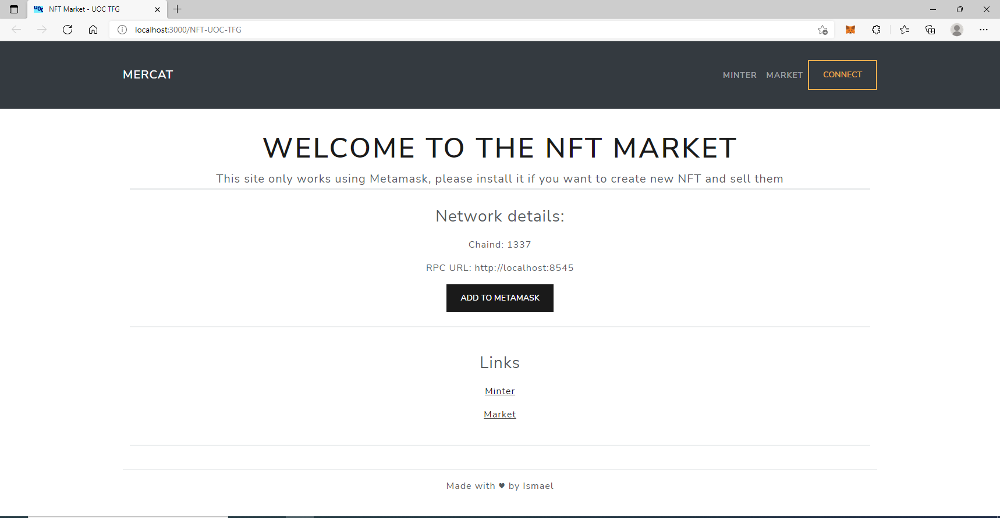
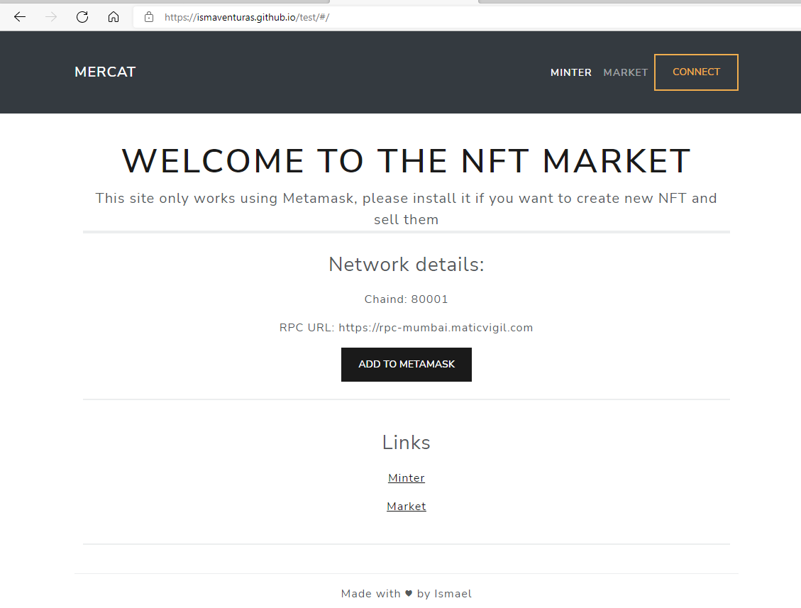

# Implementació del TFG - Mercat NFT a xarxes Ethereum

## Introducció

Aquesta es la guia per implementar un mercat NFT, tot el que no sigui part de l'execució està explicats a documents annexos.

La implementació consta de dues parts: l'entorn de desenvolupament i el llançament a producció. L'entorn de desenvolupament consisteix en una blockchain local utilitzant ganache mentre que en producció la blockchain es qualsevol de les implementacions existents de la EVM. En tots dos entorns s'utilitza el framework Truffle per compilar els programes que s'executaran a la blockchain.

La implementació ha estat testejada en Windows 10 i Ubuntu 18

## Prerequisits

- [nft.storage](https://nft.storage/) API key (Annex nft.storage)
- [node & npm](https://nodejs.org/en/)
- Navegador amb metamask (Annex Instal·lació Metamask)

- **NOMÉS PRODUCCIÓ**
  - Tokens MATIC a la wallet de metamask (Annex Instal·lació Metamask)

## Instal·lació

```bash
/> git clone https://github.com/ismaventuras/NFT-UOC-TFG.git tfg
```

Un cop descarregat entrar a totes dues carpetes (blockchain i client) i executar `npm install` per a instal·lar les dependències

```bash
/tfg> cd blockchain
/tfg/blockchain> npm install
#en altre consola
/tfg> cd client
/tfg/client> npm install
```

## Implementació desenvolupament

### blockchain

Arrancar la blockchain

```bash
/tfg/blockchain> npm run start
```

Compila els programes i llença'ls a la blockchain

```bash
#en altre consola
/tfg/blockchain> truffle migrate --network development
```

### client

```bash
/tfg > cd client
/tfg/client> npm install
```

**Important abans d'arrancar el front**

- Obtenir una [nft.storage](https://nft.storage/) API key
  - Annex nft.storage
- Crear un fitxer `.env` utilitizant `.example.env` com a base

```console
REACT_APP_DEFAULT_CHAIN_ID=1337
REACT_APP_DEFAULT_RPC=http://localhost:8545

REACT_APP_LOCAL_RPC=http://localhost:8545
REACT_APP_LOCAL_NETVERSION=5777
REACT_APP_LOCAL_CHAINID=1337

REACT_APP_BSC_TESTNET_RPC=
REACT_APP_BSC_TESTNET_NETVERSION=
REACT_APP_BSC_TESTNET_CHAINID=97

REACT_APP_MUMBAI_RPC=https://rpc-mumbai.maticvigil.com
REACT_APP_MUMBAI_NETVERSION=80001
REACT_APP_MUMBAI_CHAINID=80001

REACT_APP_NFT_API="YOUR_NFT.STORAGE_API_KEY"

REACT_APP_PUBLIC_URL="YOUR_WEBSITE_URL"
```

Arranca l'aplicació

```bash
/tfg/client> npm run start
```



## Implementació Producció

Per llençar l'aplicació a producció hi ha que triar una blockchain i un cop triada, canviar les dades crear un fitxer `.env.production` canviant les variables d'entorn `DEFAULT_CHAIN` i `DEFAULT_RPC`. És important també tenir una wallet (veure annex Metamask) amb tokens que s'utilitzin per pagar transaccions en la blockchain triada. A la part del backend haurem d'editar el fitxer `truffle-config.js` i crear un fitxer .secret amb la clau privada de la wallet per a poder llençar els programes a la blockchain.

En el nostre cas utilitzarem la xarxa Mumbai, una xarxa de proves on els tokens no tenen valor real.

### Blockchain

Editem el fitxer `truffle-config.js` descomentant les línies que permeten llençar a la els programes a la xarxa mumbai

```javascript
//...
//other code
//...
const HDWalletProvider = require('@truffle/hdwallet-provider');
const privateKey = fs.readFileSync(".secret").toString().trim();
var provider = new HDWalletProvider(privateKey, "https://rpc-mumbai.maticvigil.com")

networks:{
    //...
    //other code
    //...
    mumbai: {
       provider: provider,
       network_id:80001,
       confirmations: 2,
       timeoutBlocks: 200,
       skipDryRun: true
     },
}
//...
//other code
//...
```

Hem de crear un arxiu .secret amb la private key, de la mateixa forma que a l'arxiu `.example.secret`, per a poder llençar els programes a una blockchain local fa falta que tinguem tokens d'utilitat d'aquella xarxa, en el cas de Mumbai es necessiten MATIC token, per a aconseguir tokens MATIC es pot consultar el annexe d'instal·lació de Metamask

Un cop fet tot això, llencem els programes com hem fet abans però aquest cop triant la network mumbai

```bash
/tfg/blockchain> npm run migrate --network mumbai
```

El cost total seria el següent:

```console
Summary
=======
> Total deployments:   3
> Final cost:          0.012739612535670915 ETH
```

### Client

Creem el fitxer `.env.production` que quedaria tal que així 

```console
REACT_APP_DEFAULT_CHAIN_ID=https://rpc-mumbai.maticvigil.com
REACT_APP_DEFAULT_RPC=800001

REACT_APP_LOCAL_RPC=http://localhost:8545
REACT_APP_LOCAL_NETVERSION=5777
REACT_APP_LOCAL_CHAINID=1337

REACT_APP_BSC_TESTNET_RPC=
REACT_APP_BSC_TESTNET_NETVERSION=
REACT_APP_BSC_TESTNET_CHAINID=97

REACT_APP_MUMBAI_RPC=https://rpc-mumbai.maticvigil.com
REACT_APP_MUMBAI_NETVERSION=80001
REACT_APP_MUMBAI_CHAINID=80001

REACT_APP_NFT_API="YOUR_NFT.STORAGE_API_KEY"

REACT_APP_PUBLIC_URL="YOUR_WEBSITE_URL"
```

Fent un `npm run start:production` comproven que tot funciona amb la la blockchain Mumbai en lloc de ganache.

### Hosting de la web a Github Pages

Hem de crear un repositori a Github, crear un repositori git i pujar aquest últim al repositori de github.

Per a fer llançar l'aplicació necessitem afegir la url del repositori al camp homepage del package.json

```json
{
  "homepage":"https://your_github_user.github.io/your_github_repo"
  ...
}

```

Esborrem la carpeta oculta .git, creem el nostre repositori git i el pugem a github

```console
tfg> git init
tfg> git add .
tfg> git commit -m <commit_message>
tfg> git remote add origin https://github.com/<github_user>/<repository_name>.git
tfg> git push origin master
```

Un cop fet aquest canvi anem a la carpeta client i hem d'executar `npm run deploy` i automàticament es crearà una branca nova anomenada gh-pages i la aplicació serà accessible mitjançant la url `https://your_github_user.github.io/your_github_repo`

```console
tfg> cd client
tfg/client> npm run deploy
```



## Cheatsheet

scripts npm client:

"deploy":   use gh-pages to deploy the client to github

"start": start the app in dev mode

"start:production": start the app in prod mode

scripts npm blockchain:

"start": arranca la blockchain

migrate:  compila i llença els contractes a la blockchain, utilitzar el switch --network per decidir a quina xarxa llençar.
